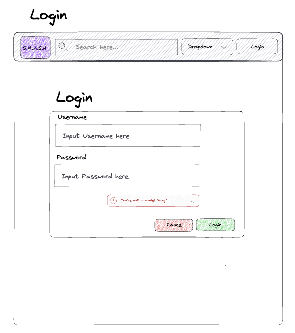
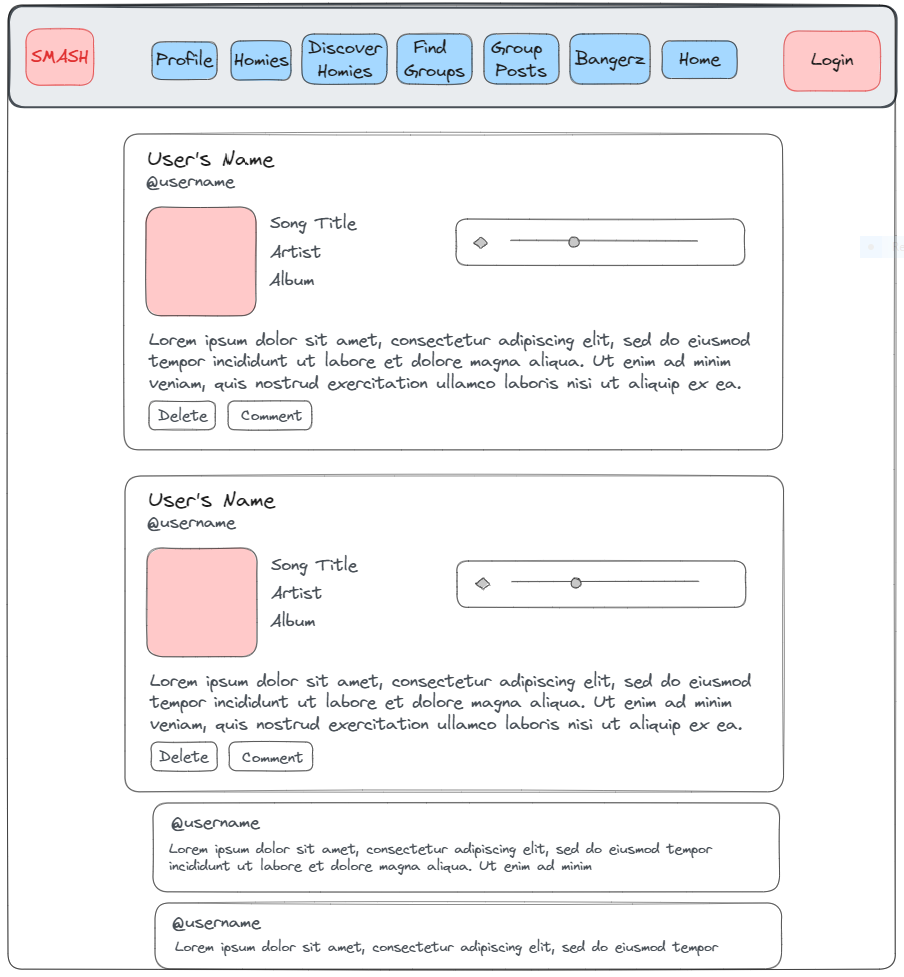
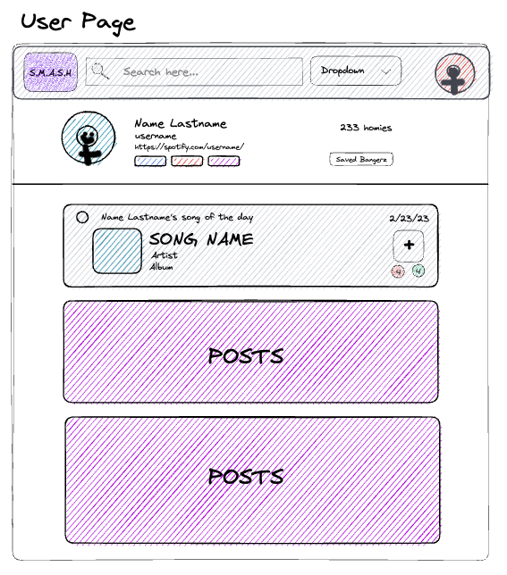
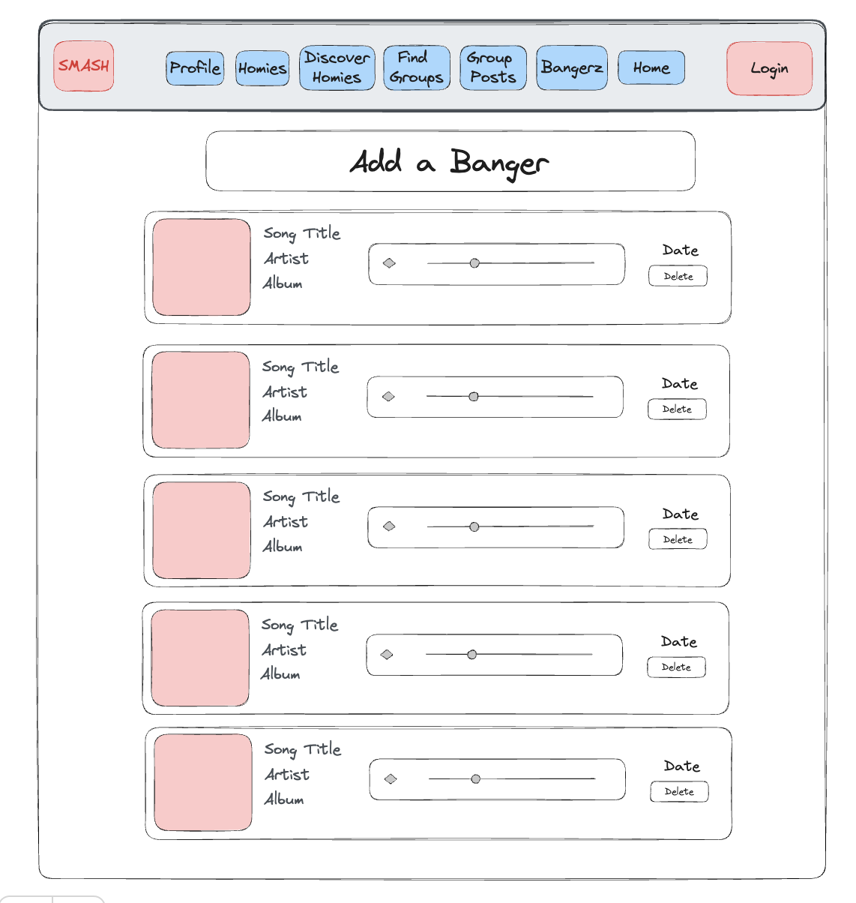
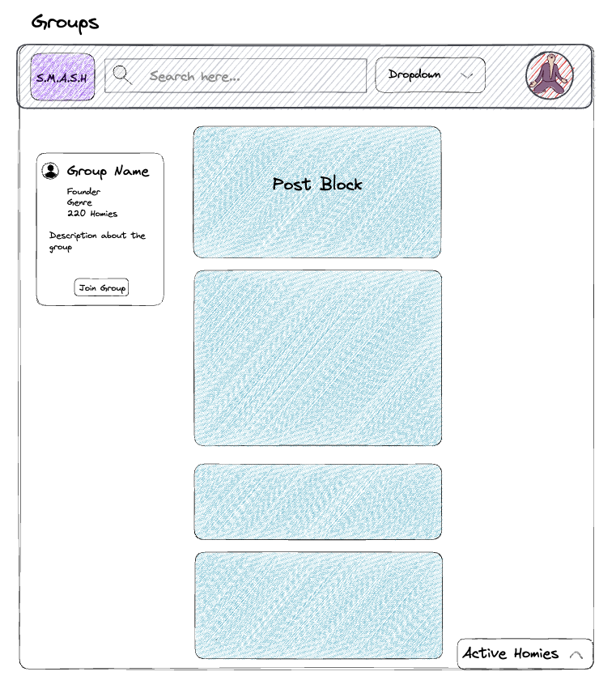
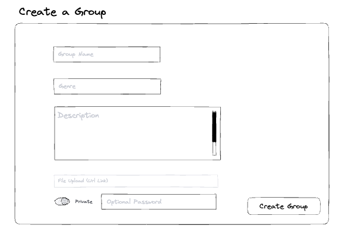

# User Graphical Human Interface

## Login Page

User can log in with the specified user and password inputs

## Home Page

Feed of posts where users can browse and comment on posts

## User Page

Page where user can access profile card, update profile, and view personal posts

## Banger Page

Feed of all bangers where users can browse and listen to the bangers

## Groups Profile Page

Feed for specific group where users can see group details and create group posts

## Group Create Page

Users can create a new group with the given inputs

